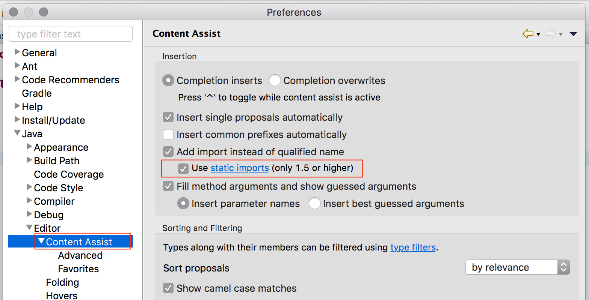
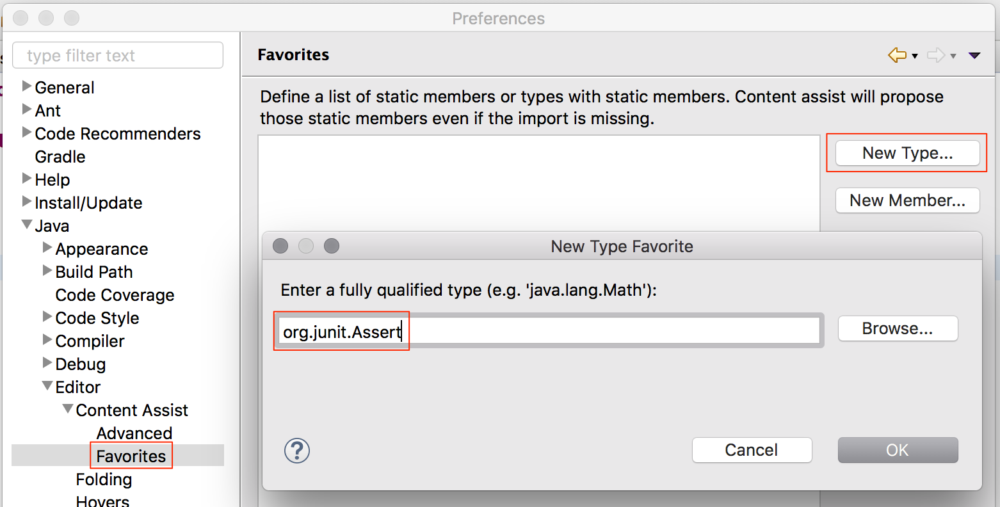

# Eclipse 技巧

## 静态导入设置

由于 Hamcrest、Mockito 以及其他一些工具都使用了静态方法作为语句的入口，使用`static import`省去方法所属的类名会让代码阅读起来更流畅，而 Eclipse 中默认在敲出静态方法名时代码辅助功能是无效的，需要进行设置，步骤如下。

1. 开启静态导入

    进入`Preference -> Java -> Editor -> Content Assist`，勾选`Use static imports (only 1.5 or higher)`
    

2. 添加静态导入的类型

    进入`Preference -> Java -> Editor -> Content Assist -> Favorites`，点击`New Type...`分别加入如下类型：  
    `org.junit`  
    `org.junit.Assert`  
    `org.hamcrest.CoreMatchers`  
    `org.hamcrest.Matchers`  
    `org.mockito.BDDMockito`或`org.mockito.Mockito`  
    
    > 如果还有其它需要静态导入的成员，请自行添加

这样修改之后，不需再敲击`Assert.`之后才能选择`assertThat`方法；直接敲击`at`之后代码补全就可以找到对应的方法，最终效果如下：
    

## 测试代码模板

在编写单元测试的过程中，我们会经常要写一些重复的八股文代码，例如测试方法:

```java
@Test
public void should_...() {
}
```

这里的代码每个测试都需要写一遍，太繁琐，我们可以使用代码模板来自动生成它。当设置好代码模板之后，只需要敲几个字母就可以把代码补全出来，我们就可以专注于代码中真正有意义的那部分：这个测试的场景（方法名）

还有其他一些类似的情形，比如编写断言的时候，我们会写`assertThat(actual, is(matcher))`；也可以使用代码模板生产`assertThat(..., is(...))`之后在专注于填充实际值和期待值。

下面以添加缩写为`sho`的生成测试方法的模板为例介绍设置方法。

1. 进入`Preference -> Editor -> Code -> Templates`设置界面，点击`New...`开始新建模板

2. 在弹出的新建对话框中填入：
    * Name：`sho` 模板的名字，敲击这几个字母后可以激活模板
    * Context：`Java Type Members` 仅在添加类型成员时生效
    * Description：`@Test public void should...() {}` 在代码补全对话框弹出时显式的提示
    * Pattern：
    ```java
    @${testType:newType(org.junit.Test)}
    public void should_${testName}() throws Exception {    
    }
    ```
    要补全的代码模板，其中有一些变量
            > 界面上的选项的具体说明可以单击对话框左下角的`?`查看说明。
    



